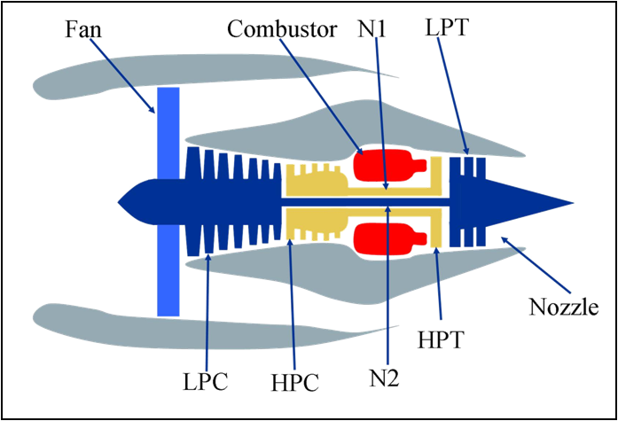
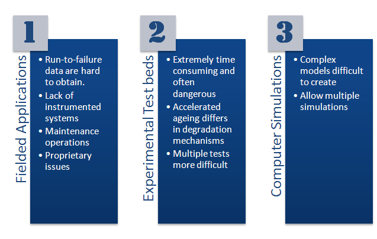
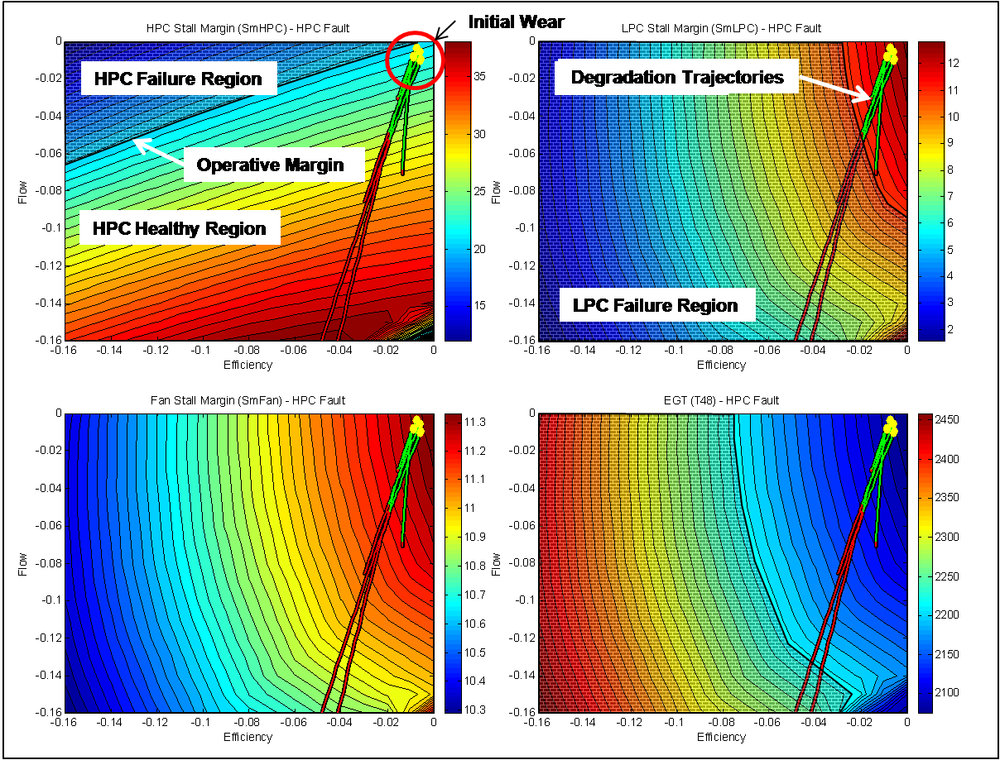
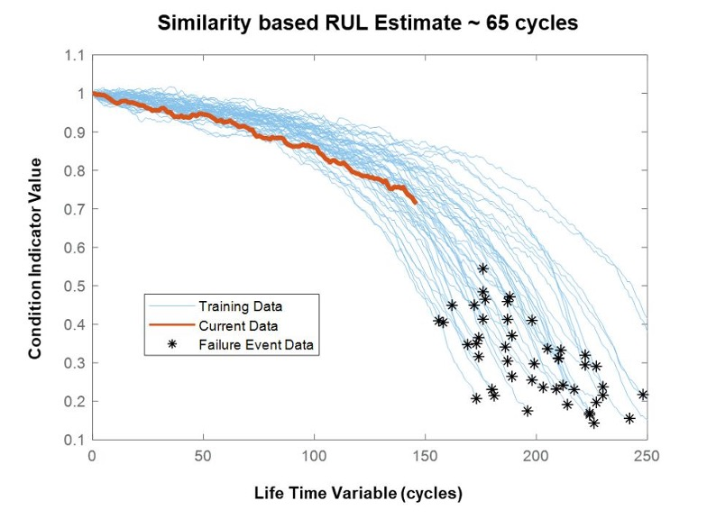

# DCNN for Machine RUL Prediction using Time-series Data

[Download Data](https://data.nasa.gov/Aerospace/CMAPSS-Jet-Engine-Simulated-Data/ff5v-kuh6)

### Turbofan Jet Engine

### Degradation Data for Prognostic Algorithm Development

### Damage Propagation Modeling

### Run to failure data
In figure, the degradation profiles of historical run-to-failure data sets from an engine are shown in blue and the current data from the engine is shown in red. Based on the profile the engine most closely matches, the RUL is estimated to be around 65 cycles.

### References:
[1] NASA Datasets: https://www.nasa.gov/content/prognostics-center-of-excellence-data-set-repository

[2] https://www.kaggle.com/datasets/behrad3d/nasa-cmaps

[3] Data Set Citation: A. Saxena and K. Goebel (2008). "Turbofan Engine Degradation Simulation Data Set", NASA Prognostics Data Repository, NASA Ames Research Center, Moffett Field, CA

[4] https://www.mathworks.com/company/newsletters/articles/three-ways-to-estimate-remaining-useful-life-for-predictive-maintenance.html 

[5] https://www.mathworks.com/help/predmaint/ug/remaining-useful-life-estimation-using-convolutional-neural-network.html

[6] https://github.com/datrikintelligence/stacked-dcnn-rul-phm21
